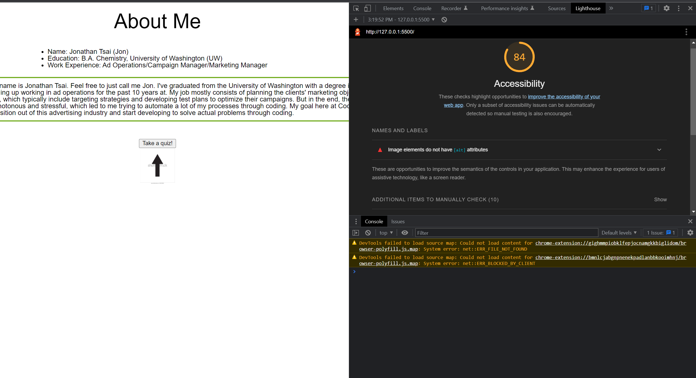

# Lab - 2

This is a lab to practice conditional statement for inputs. This page utilizes a eventListener to start the quiz once the button is clicked.

An input valdiation function was also implemented to check the user's response.

The asscesbaility score screenshot is shown here:

